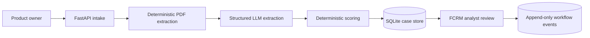

# Architecture Overview

The LLM structures untrusted source text; it does not make an approval decision. Scoring is deterministic so category scores and thresholds can be reproduced. SQLite is a deliberately small persistence choice for the synthetic demo and can be replaced by Postgres without changing the domain contracts.

The case record stores the extracted version, assessment, status, timestamps, and a stable case ID. Workflow events store the actor and rationale for human actions.
