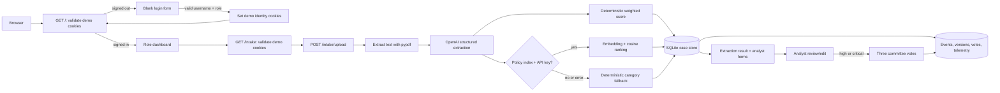

# Architecture Overview

```mermaid
flowchart LR
    BROWSER[Browser] --> ROOT[GET /: validate demo cookies]
    ROOT -->|signed out| LOGIN[Blank login form]
    ROOT -->|signed in| DASH[Role dashboard]
    LOGIN -->|valid username + role| COOKIE[Set demo identity cookies]
    COOKIE --> ROOT
    DASH --> INTAKE[GET /intake: validate demo cookies]
    INTAKE --> UPLOAD[POST /intake/upload]
    UPLOAD --> PDF[Extract text with pypdf]
    PDF --> LLM[OpenAI structured extraction]
    LLM --> SCORE[Deterministic weighted score]
    LLM --> POLICY{Policy index + API key?}
    POLICY -->|yes| SEMANTIC[Embedding + cosine ranking]
    POLICY -->|no or error| RULES[Deterministic category fallback]
    SCORE --> STORE[(SQLite case store)]
    SEMANTIC --> STORE
    RULES --> STORE
    STORE --> RESULT[Extraction result + analyst forms]
    RESULT --> ANALYST[Analyst review/edit]
    ANALYST -->|high or critical| COMMITTEE[Three committee votes]
    STORE --> EVENTS[(Events, versions, votes, telemetry)]
    COMMITTEE --> EVENTS
```

The root route validates the `demo_user` and `demo_role` cookies against the
fixed demo-user mapping and redirects signed-out browsers to login or
signed-in browsers to the matching dashboard. The `/intake` browser page
performs the same validation. The login form starts blank; a successful login
sets the identity cookies, and the switch-role link clears them before
returning to login.

The upload POST endpoint does not apply the same role check as the browser
intake page. The `/intake/committee-queue/demo` page is also not role-gated;
the regular committee queue checks the role string but does not validate the
username-role pair. Analyst actions submitted from the extraction result use a
fixed demo analyst header and an editable actor field. These are material demo
limitations: the browser checks are not a complete authorization boundary.

The LLM structures untrusted source text; it does not make an approval
decision. Scoring is deterministic so category scores and thresholds can be
reproduced. Policy evidence uses semantic embedding retrieval only when an
index and API key are available; otherwise it uses a rule-based category
fallback. The policy corpus is synthetic demonstration material, not approved
supervisory guidance.

SQLite stores case data, the current extraction and assessment, policy
evidence, extraction versions, workflow events, committee votes, and telemetry.
The uploaded PDF itself is not persisted. Workflow history is append-only by
application behavior, not protected by database-level immutability. Committee
voting requires three distinct authenticated demo usernames at the voting
route; two approvals approve, two rejections reject, and a full vote without
either majority defers. This is prototype behavior, not an institutionally
approved decision policy.

SQLite is a deliberately small persistence choice for the synthetic demo. A
production database migration would require a persistence adapter and
migrations; domain contracts can remain stable, but there is not currently a
separate repository abstraction.

Production increments include consistent endpoint authorization and real
identity, database-enforced audit controls, source-document storage, approved
policy and decision mappings, and control-effectiveness/residual-risk data.
