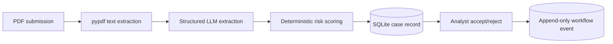

# Risk Assessment Workbench
## Genius Hacks 2026 presentation outline

### Slide 1 - The problem

- Financial crime risk assessment currently moves through email, Word, Excel, and SharePoint.
- Analysts spend 15-20 business days preparing an assessment.
- Similar changes can receive different conclusions.
- Reconstructing the reason for a rating is slow when an examiner asks later.

**Message:** the product is a governed preparation and review workflow, not an automatic decision engine.

### Slide 2 - Expanded product definition

**Users**

- Product owner submits a change request.
- FCRM analyst verifies extracted facts and owns the assessment.
- Risk committee makes the final decision for escalated cases.

**Workflow target**

`Submitted -> Extracted -> Analyst Review -> Analyst Finalized -> Committee Review -> Decisioned`

**Current implementation**

`Submitted -> Extracted -> Analyst Review -> Analyst Finalized -> Committee Review -> Decisioned`

See `docs/requirements/spec.md`.

### Slide 3 - What we built

- FastAPI and Jinja2/HTMX provide the application flow.
- Pydantic validates the extraction contract.
- SQLite persists the case and audit event.
- The result remains a draft until a human acts.

### Slide 4 - AI harness and context boundary

- The model extracts only facts stated or clearly implied in the source.
- Structured outputs prevent malformed data from reaching scoring.
- The PDF is explicitly treated as untrusted data; embedded instructions cannot override system rules.
- The prompt and model configuration live in `/ai` and are inspectable.
- Risk scoring stays deterministic and outside the LLM.

**Why:** probabilistic extraction benefits from an LLM; scoring and workflow transitions must be reproducible.

### Slide 5 - Human-in-the-loop governance

- Every upload receives a durable case ID.
- The extraction and score are drafts.
- Analyst accept/reject actions require an actor and rationale.
- Workflow events are timestamped and append-only in the demo store.
- High and critical assessments are flagged for committee review.
- No approval or rejection is performed automatically.

**Current limitation:** the demo uses cookie/header-based roles and an application-enforced three-member quorum; real identity, explicit decision policy, and database-level immutability are production increments.

### Slide 6 - Risk scoring

Current categories:

- Customer and geography: 35%
- Product and channel: 30%
- Third party/vendor: 20%
- Change complexity: 15%

The scorer produces category scores, rationales, an overall score, risk level, and committee-review flag.

**Engineering decision:** use deterministic weighted rules so a committee can reproduce and challenge the result.

**Caveat:** the current weights are prototype values and require formal supervisory-framework mapping before production.

### Slide 7 - Evaluation approach

- Eight synthetic cases are stored in `evals/data/synthetic_cases.json`.
- Cases cover low risk, new segments, vendors, high-risk geographies, ambiguity, contradiction, multi-product scope, and embedded prompt-injection text.
- Contract tests validate schema parsing and deterministic score outcomes.
- PDF fixture `evals/data/sample_change_request.pdf` exercises every extraction field.

**Latest recorded run:** 0/8 successful calls because all provider attempts ended with `APIConnectionError`. It is not a model-quality baseline; rerun the paid evaluation with a reachable provider before presenting accuracy figures.

### Slide 8 - SDLC evidence

**Requirements:** expanded personas, states, acceptance criteria, and scope in `/docs/requirements`.

**Design:** architecture diagram, data model, and decision log in `/docs/architecture`.

**Development:** structured extraction, deterministic scoring, persistence, and analyst review in `/src`.

**Testing:** pytest cases and synthetic evaluation fixtures in `/tests` and `/evals`.

**Deployment:** Dockerfile, Compose, database volume, environment configuration, and health endpoint.

**Operations:** monitoring and token-usage plans in `/ops`.

### Slide 9 - Deployment and operations

- Containerized FastAPI application.
- Environment-based API configuration.
- Durable SQLite volume for the demo; Postgres is the production target.
- `/healthz` supports a basic health check.
- Telemetry records model latency, failures, prompt version, input/output token counts, and success status.

**Production gaps:** real authentication/authorization, migrations, source-document storage, retries/timeouts, database-enforced audit immutability, and measured cost optimization.

### Slide 10 - Demonstration

1. Open the intake page.
2. Upload `evals/data/sample_change_request.pdf`.
3. Show extracted fields and deterministic category scores.
4. Show the case ID and draft status.
5. Enter a synthetic analyst identity and rationale.
6. Accept or reject the draft.
7. Show the persisted workflow status.
8. Submit a high-risk case to the committee queue and record a conditional decision.
9. Explain how the audit events and extraction version support later review.

### Slide 11 - Failure handling

- Empty text-layer PDF returns a clear extraction error.
- Non-PDF uploads are rejected.
- Uploads over 10 MB are rejected.
- Structured-output failures return an analyst-facing error.
- Ambiguous and adversarial synthetic cases are retained for evaluation.
- Human rejection records the rationale instead of silently changing the draft.

### Slide 12 - Closing and next increments

**What is demonstrated today:** governed intake, AI-assisted extraction, deterministic scoring, persistence, analyst review, synthetic evaluation, and delivery evidence.

**Next increments:** published-framework approval, controls and residual risk, real authentication, database-enforced audit immutability, and operational dashboards.

**Closing message:** the system prepares evidence and makes reasoning visible; humans remain accountable for decisions.
