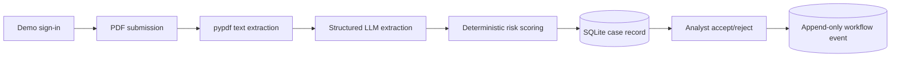

# Risk Assessment Workbench
## Genius Hacks 2026 presentation outline

### Slide 1 - The problem

- Financial crime risk assessment currently moves through email, Word, Excel, and SharePoint.
- Similar changes can receive different conclusions.
- Reconstructing the reason for a rating is slow when an examiner asks later.

**Message:** the prototype organizes evidence for human review; it is not an automatic decision engine. Avoid unverified cycle-time savings claims.

### Slide 2 - Expanded product definition

**Users**

- Product owner submits a change request.
- FCRM analyst verifies extracted facts and owns the assessment.
- Risk committee makes the final decision for escalated cases.

**Workflow target**

`Submitted -> Extracted -> Analyst Review -> Analyst Finalized -> Committee Review -> Decisioned`

**Current implementation**

`Submitted -> Extracted -> Analyst Review -> Analyst Finalized -> Committee Review -> Decisioned`

The browser demo uses fixed username/role pairs and session cookies. This is a demo access gate, not production identity or authorization. See `docs/requirements/spec.md`.

### Slide 3 - What we built

```mermaid
flowchart LR
    AUTH[Demo sign-in] --> PDF[PDF submission]
    PDF --> TEXT[pypdf text extraction]
    TEXT --> LLM[Structured LLM extraction]
    LLM --> SCORE[Deterministic risk scoring]
    SCORE --> CASE[(SQLite case record)]
    CASE --> REVIEW[Analyst accept/reject]
    REVIEW --> AUDIT[(Append-only workflow event)]
```

- FastAPI and Jinja2/HTMX provide the application flow.
- Pydantic validates the extraction contract.
- SQLite persists the case and audit event.
- The result remains a draft until a human acts.
- `/intake` requires a valid demo session; the upload POST endpoint itself currently lacks an equivalent role check, so this is not a production security boundary.

### Slide 4 - AI harness and context boundary

- The model extracts only facts stated or clearly implied in the source.
- Structured outputs prevent malformed data from reaching scoring.
- The prompt treats submitted document text as untrusted data and instructs the model not to follow embedded directions.
- The prompt and model configuration live in `/ai` and are inspectable.
- Risk scoring stays deterministic and outside the LLM.
- Policy evidence uses semantic retrieval when an index and API key are available; otherwise it falls back to deterministic category rules.

**Why:** probabilistic extraction benefits from an LLM; scoring and workflow transitions must be reproducible. Policy snippets are synthetic demo material, not approved supervisory guidance.

### Slide 5 - Human-in-the-loop governance

- Every upload receives a durable case ID.
- The extraction and score are drafts.
- Analyst accept/reject actions require an actor and rationale.
- Workflow events are timestamped and append-only through the application, but not protected by database-level immutability.
- High and critical assessments are flagged for committee review.
- No approval or rejection is performed automatically.
- The demo committee rule counts three distinct members; two approvals approve, two rejections reject, and no majority defers the case.

**Current limitation:** identity is demo-only; some endpoints are not role-gated consistently; actor fields are not uniformly bound to authenticated identities. The quorum rule is prototype behavior, not an institutionally approved decision policy.

### Slide 6 - Risk scoring

Current categories:

- Customer and geography: 35%
- Product and channel: 30%
- Third party/vendor: 20%
- Change complexity: 15%

The scorer produces category scores, rationales, an overall score, risk level, and committee-review flag.

**Engineering decision:** use deterministic weighted rules so a committee can reproduce and challenge the result.

**Caveat:** these are placeholder prototype weights, not validated or approved supervisory-framework mappings. Controls and residual risk are not modeled.

### Slide 7 - Evaluation approach

- Eight synthetic cases are stored in `evals/data/synthetic_cases.json`.
- Cases cover low risk, new segments, vendors, high-risk geographies, ambiguity, contradiction, multi-product scope, and embedded prompt-injection text.
- Contract tests validate schema parsing and deterministic score outcomes.
- PDF fixture `evals/data/sample_change_request.pdf` exercises every extraction field.

**Latest recorded live run:** 8/8 successful calls; 54/80 expected fields correct (67.5% field accuracy); deterministic risk-level agreement was 8/8 (100%); mean latency was 2,790 ms. This is a small synthetic evaluation, not a production accuracy estimate. Perfect risk agreement does not mean all extracted fields were correct.

**Automated tests:** 59 passed in the latest local full-suite run. CI is configured to run pytest on pushes and pull requests to `master`; a successful hosted CI run is not claimed here.

### Slide 8 - SDLC evidence

**Requirements:** expanded personas, states, acceptance criteria, and scope in `/docs/requirements`.

**Design:** architecture diagram, data model, and decision log in `/docs/architecture`.

**Development:** structured extraction, deterministic scoring, persistence, and analyst review in `/src`.

**Testing:** 59 passing local pytest cases, CI configuration, and an eight-case synthetic live-evaluation fixture in `/tests`, `.github/workflows/ci.yml`, and `/evals`.

**Deployment:** Dockerfile, Compose, database volume, environment configuration, and health endpoint.

**Operations:** monitoring and token-usage plans in `/ops`.

### Slide 9 - Deployment and operations

- Containerized FastAPI application.
- Environment-based API configuration.
- Durable SQLite volume for the demo; Postgres is the production target.
- `/healthz` supports a basic health check.
- Telemetry records model latency, failures, prompt version, input/output token counts, and success status.
- Live extraction requires a configured OpenAI API key; policy retrieval alone has a deterministic fallback.

**Production gaps:** consistent endpoint authorization, real identity, migrations, source-document storage, provider-specific timeout tuning, database-enforced audit immutability, approved policy mappings, residual-risk controls, and measured cost optimization.

### Slide 10 - Demonstration

1. Open `http://127.0.0.1:8000/` and explicitly sign in as `product-owner-1` with the Product owner role.
2. Open Upload case and submit `evals/data/sample_change_request.pdf`.
3. Show extracted fields, policy evidence, deterministic category scores, case ID, and draft status.
4. Use Sign in / switch role; explicitly choose FCRM analyst and enter `analyst-1`.
5. Review/edit the extraction, provide a rationale, and finalize the assessment.
6. Submit a high/critical case for committee review.
7. Switch among `committee-1`, `committee-2`, and `committee-3`; cast approve, reject, defer, or approve-with-conditions votes. Three distinct votes are required; a full vote without an approval or rejection majority defers.
8. Show the resulting status, version history, and timestamped workflow events. Describe them as application-enforced demo records, not tamper-proof audit storage.

### Slide 11 - Failure handling

- Textless and malformed PDFs return clear extraction errors.
- Non-PDF uploads are rejected.
- Uploads over 10 MB are rejected.
- Provider connection, timeout, and rate-limit failures are retried up to three times; exhausted/model validation failures return an analyst-facing error.
- Ambiguous and adversarial synthetic cases are retained for evaluation.
- Human rejection records the rationale instead of silently changing the draft.
- The browser intake route redirects signed-out users to login, but the upload API endpoint does not currently enforce the same role check; do not present the demo as securely access-controlled.

### Slide 12 - Closing and next increments

**What is demonstrated today:** demo-session intake, AI-assisted extraction, deterministic scoring, policy-evidence retrieval/fallback, SQLite persistence, analyst review, three-member committee voting, synthetic evaluation, and delivery evidence.

**Next increments:** consistent endpoint authorization, real authentication, approved framework mappings and decision policy, controls and residual risk, database-enforced audit immutability, source-backed extraction citations, and operational dashboards.

**Closing message:** the system prepares evidence and makes reasoning visible; humans remain accountable for decisions.
